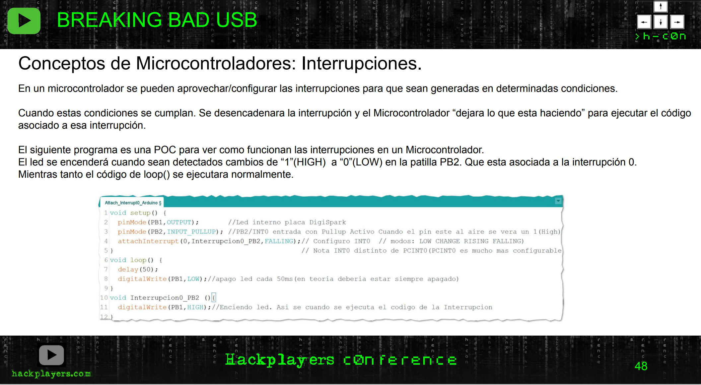

# BreakingBadUSB
##### [Código y esquemas charla BreakingBadUSB impartida en la H-CON por Rober y Jejo (usando un Attiny como MitM de un teclado USB). <br/> (H-C0N:Hackplayers Conference 2022)](https://www.h-c0n.com/p/ponencias2022.html#Charla_RobertoCasado_SergioBlazquez)


 

[Ver/descargar codigo](POC_attach_interrupt0_Arduino_mode.ino)

```cpp
// Attach_interupt_on_USB POC de configurar una interrupcion interrupcion0 del Attiny85
//
// CC Attribution-ShareAlike 4.0 International (CC BY-SA 4.0)
// https://creativecommons.org/licenses/by-sa/4.0/
// CC 2022 https://euskalhack.org/ 
// =============================================================================================
//             Patillaje Placa DigiSpark
//
//                +-----------------+
//                |     ,-----+     |
//       +--------+     |     |   O | PB5 (D5) RESET/ADC0
// Gnd   | ======       +-----+   O | PB4 (D4) USB+  ADC2
// USB+  |   ====             "   O | PB3 (D3) USB-  ADC3 
// USB-  |   ====      ______     O | PB2 (D2) SCK/SCL/INT0/ADC1
// Vcc   | ======     |      |    O | PB1 (D1) LED" MISO/DO/OC0B/OC1A/AIN1/PCINT1
//       +--------+   |______|    O | PB0 (D0) MOSI/DI/SDA/OC0A/AIN0
//                |  O O O "        | 
//                +-----------------+
//                 5V GND Vin
// =============================================================================================

void setup() {
  pinMode(PB1,OUTPUT);       //Led interno placa DigiSpark
  pinMode(PB2,INPUT_PULLUP); //PB2/INT0 entrada con Pullup Activo Cuando el pin este al aire se vera un 1(High)
  attachInterrupt(0,Interrupcion0_PB2,FALLING);// Configuro INT0  // modos: LOW CHANGE RISING FALLING)
}                                              // Nota INT0 distinto de PCINT0(PCINT0 es mucho mas configurable)
void loop() {
  delay(50);
  digitalWrite(PB1,LOW);//apago led cada 50ms(en teoria deberia estar siempre apagado)
}
void Interrupcion0_PB2 (){
  digitalWrite(PB1,HIGH);//Enciendo led. Asi se cuando se ejecuta el codigo de la Interrupcion
}
```


___


<a href="http://euskalhack.org/">

</a>
