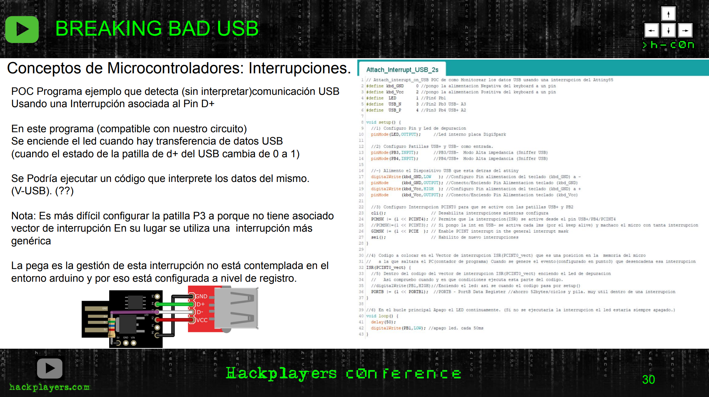

# BreakingBadUSB
##### [Código y esquemas charla BreakingBadUSB impartida en la H-CON por Rober y Jejo (usando un Attiny como MitM de un teclado USB). <br/> (H-C0N:Hackplayers Conference 2022)](https://www.h-c0n.com/p/ponencias2022.html#Charla_RobertoCasado_SergioBlazquez)

 
  
[Ver/descargar codigo](./POC_attach_interrupt_on_USB_pin_es.ino)

  
  ```cpp
  // Attach_interupt_on_USB POC de como Monitorear los datos USB usando una interrupcion del Attiny85
// CC Attribution-ShareAlike 4.0 International (CC BY-SA 4.0)
// https://creativecommons.org/licenses/by-sa/4.0/
// https://euskalhack.org/ 
// =============================================================================================
//            Esquema Basico Breaking Bad USB
//            x Para que funcione mejor tienes que quitar con un cuter la resistencia original de 1k5
//              situada en el punto "x" y substituirla por una de 5K6 si no la deteccion USB falla al haber 2 resistencia pullup
//               +-------------------+         __________   
//               |   x  ,-----+      |        |          |\
//      +--------+      |     |  P5 O|   /----| GND      |.\ 
// Gnd  | ======        +-----+  P4 O+--------| USB+     |:|
//      |   ====     +---[R5K6]--P3 O+--------| USB-     |:|
//      |   ====     |           P2 O+--------| Vcc      |:|   
// Vcc  | ======     |           P1 O|   |    |__________|'|             
//      +--------+ 5v|           P0 O+---+     \__________\|
//               |   O O O           |     
//               +-------------------+      
//
// =============================================================================================


#define kbd_GND     0 //pongo la alimentacion Negativa del keyboard a un pin
#define kbd_Vcc     2 //pongo la alimentacion Positiva del keyboard a un pin
#define  LED        1 //Pin6 Pb1 
#define  USB_N      3 //Pin2 Pb3 USB- A3 
#define  USB_P      4 //Pin3 Pb4 USB+ A2

void setup() {
  //1) Configuro Pin y Led de depuracion
  pinMode(LED,OUTPUT);     //Led interno placa DigiSpark

  //2) Configuro Patillas USB+ y USB- como entrada.
  pinMode(PB3,INPUT);      //PB3/USB-  Modo Alta impedancia (Sniffer USB)
  pinMode(PB4,INPUT);      //PB4/USB+  Modo Alta impedancia (Sniffer USB)

  //-) Alimento el Dispositivo USB que esta detras del attiny
  digitalWrite(kbd_GND,LOW   ); //Configuro Pin alimentacion del teclado (kbd_GND) a -
  pinMode     (kbd_GND,OUTPUT); //Conecto/Enciendo Pin Alimentacion teclado (kbd_GND) 
  digitalWrite(kbd_Vcc,HIGH  ); //Configuro Pin alimentacion del teclado (kbd_GND) a +
  pinMode     (kbd_Vcc,OUTPUT); //Conecto/Enciendo Pin Alimentacion teclado (kbd_Vcc) 

  //3) Configuro Interrupcion PCINT0 para que se active con las patillas USB+ y PB2
  cli();                  // Desabilita interrupciones mientras configura
  PCMSK |= (1 << PCINT4); // Permite que la interrupcion(ISR) se active desde el pin USB+/PB4/PCINT4 
  //PCMSK|=(1 << PCINT3); // Si pongo la int en USB- se activa cada 1ms (por el keep alive) y machaco el micro con tanta interrupcion
  GIMSK |= (1 << PCIE  ); // Enable PCINT interrupt in the general interrupt mask
  sei();                  // Habilito de nuevo interrupciones
}

//4) Codigo a colocar en el Vector de interrupcion ISR(PCINT0_vect) que es una posicion en la  memoria del micro 
//   a la que saltara el PC(contador de programa) Cuando se genere el evento(configurado en punto3) que desencadena esa interrupcion
ISR(PCINT0_vect) {
  //5) Dentro del codigo del vector de interrupcion ISR(PCINT0_vect) enciendo el Led de depuracion 
  //   Asi compruebo cuando y en que condiciones ejecuta esta parte del codigo. 
  //digitalWrite(PB1,HIGH);//Enciendo el led: asi se cuando el codigo pasa por setup()
  PORTB |= (1 << PORTB1);  //PORTB – PortB Data Register //ahorro 52bytes/ciclos y pila. muy util dentro de una interrupcion
}

//6) En el bucle principal Apago el LED continuamente. (Si no se ejecutaria la interrupcion el led estaria siempre apagado.)
void loop() {
  delay(50);
  digitalWrite(PB1,LOW); //apago led. cada 50ms
}

  ```

___
<a href="http://euskalhack.org/">

</a>
