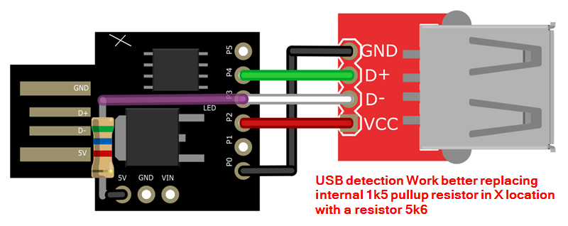

# BreakingBadUSB
##### [Código y esquemas charla BreakingBadUSB impartida en la H-CON por Rober y Jejo (usando un Attiny como MitM de un teclado USB).   (H-C0N:Hackplayers Conference 2022)](https://www.h-c0n.com/p/ponencias2022.html#Charla_RobertoCasado_SergioBlazquez)

 
  
[Ver/descargar codigo](./POC_connect_disconnect_keyboard_es.ino)
Esquema:

 

Pasos del poc:
1) Inicio teclado interno (libreria DigiKeyboard.h)
2) lanzo payload 
3) Desconecto teclado interno USB  (libreria DigiKeyboard.h)
4) dejo pasar las señales USB a través del cable. (patillas usb en alta impedancia)
5) Alimento teclado USB conectando detras del attiny patillas PB0 y PB2 (ver esquema)

