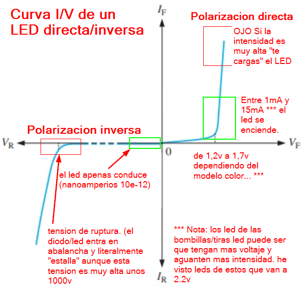
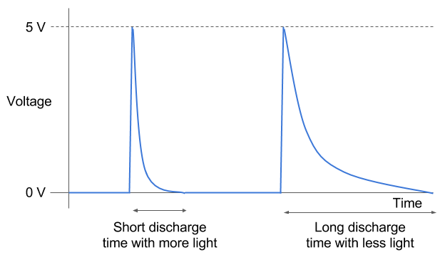

# BreakingBadUSB
##### [Código y esquemas charla BreakingBadUSB impartida en la H-CON por Rober y Jejo (usando un Attiny como MitM de un teclado USB). <br/> (H-C0N:Hackplayers Conference 2022)](https://www.h-c0n.com/p/ponencias2022.html#Charla_RobertoCasado_SergioBlazquez)

Esta parte al final no la introducimos en el prototipo final.   
Pero su diseño me gusta tanto que no he podido evitar incluirlo en la documentacion.

___

### Como "hackear" un LED para convertirlo en un sensor de Luz.  

La idea es hacer un sensor de luz de bajo coste. (sin elementos especiales.)   

Para ello aprovechamos una caracteristica curiosa de los diodos led.
   - Cuando estan en inversa se comportan como un pequeño condensador.  
   Que se descarga en funcion de la cntidad de luz que le incida.

(Polarizacion inversa es cuando les aplicas tension "al reves" de forma que el led no luce y tampoco conduce la electricidad. )   




A diferencia de un diodo normal el semiconductor del led esta expuesto a la luz.   
Y su comportamiento cambia en funcion de la luz que le incida.  
En nuestro caso vamos a aprovechar esto para "medir la luz"  



### Explicacion:   
1) Cargo el LED (polarizacion inversa)   
2) Patilla led en alta impedancia   
3) Mido el tiempo de descarga (menos tiempo mas luz)    
  
[Ver/descargar codigo](./POC_light_Sensor_using_led_in_reverse_mode_es.ino)
  
  ```cpp
  // POC light Sensor on Attiny85 using a led in reverse mode 
// POC Sensor de luz usando un led en polarizacion inversa
//
// CC Attribution-ShareAlike 4.0 International (CC BY-SA 4.0)
// https://creativecommons.org/licenses/by-sa/4.0/
// https://euskalhack.org/ 
//
//
#include <DigiUSB.h> //debug info
// NOTAS: DigiUSB.h Cambio #define RING_BUFFER_SIZE 128 por #define RING_BUFFER_SIZE 64
// asi ahorro RAM. El chip va muy justo de RAM. (no deberia pasar de 50%) Cuando hay poca RAM libre 
// Se desborda la pila y se puede perder el bootloader. (vamos que te lo cargas)
//
//                 +------------------+
//                 |     ,-----+      |
//        +--------+     |     |  P5 O|                                   PB5 (D5) RESET/ADC0
// Gnd(-) | ======       +-----+  P4 O|                                   PB4 (D4) USB+ ADC2
//        |   ====             "  P3 O|                                   PB3 (D3) USB- ADC3     
//        |   ====      ______    P2 O+----------+                        PB2 (D2) SCK/SCL/INT0/ADC1
// Vcc(+) | ======                P1 O|        __|__                      PB1 (D1) LED" MISO/DO/AIN1/PCINT1
//        +--------+ 5 GND Vin    P0 O|        \   / =>"  LED             PB0 (D0) MOSI/DI/SDA/OC0A/AIN0
//                 |  O O O "         |         \ /  =>   En inversa
//                 +--+---------------+       -------
//                    |__________________________|
//Explicacion:
//1) Cargo el LED (polarizacion inversa)
//2) Patilla led en alta impedancia
//3) Mido el tiempo de descarga (menos tiempo mas luz)
//
void setup(){
  DigiUSB.begin();
  pinMode(PB1, OUTPUT);
  digitalWrite(PB1, HIGH);
  DigiUSB.delay(1000);   //mejora la deteccion del dispositivo USB
}
void loop(){
  DigiUSB.print("Sensor_luz:  ");
  DigiUSB.delay(100);   //retardo para asegurar la transmision

  // Sensor luz con Diodo LED en inversa entre PB2 y Vcc
  pinMode(PB2, OUTPUT);          //1)Cargo el LED luego PB2=0
  digitalWrite(PB2, LOW);        //Explicacion el led en inversa se comporta como un condensador
  DigiUSB.delay(100);            //luego almacena un poco de carga electrica
  
  pinMode(PB2, INPUT);           //2) Patilla PB2 en alta impedancia (muy poco consumo)
  
  //3) Mido la luz en funcion del tiempo de descarga (menos tiempo mas luz)
  int i = 0;                     //Explicacion:
  for(i=0; i<254 ; i++){         //el Tiempo que tarda el LED 
      if(digitalRead(PB2))break; //en descargarse depende
      DigiUSB.delay(1);          //de la cantidad de LUZ 
  }                              //que incida en la superficie del mismo

  //POC enciedo el led interno si no hay luz (a lo fotocelula)
  if(i>253){
      digitalWrite(PB1, HIGH);    
  }else{
      digitalWrite(PB1, LOW);
  }
  // Depuracion Observo el valor en tiempo real.
  DigiUSB.print(" t=");
  DigiUSB.println(int(i));
  DigiUSB.delay(250);//retardo para asegurar la transmision del dato
}
  ```

### Referencias:
https://www.petervis.com/Education/diode-characteristics-curve/diode-characteristics-curve.html

___
<a href="http://euskalhack.org/">

</a>
